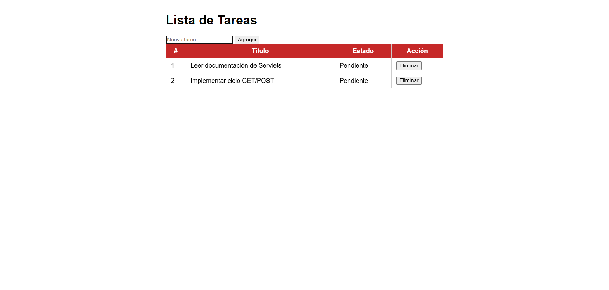
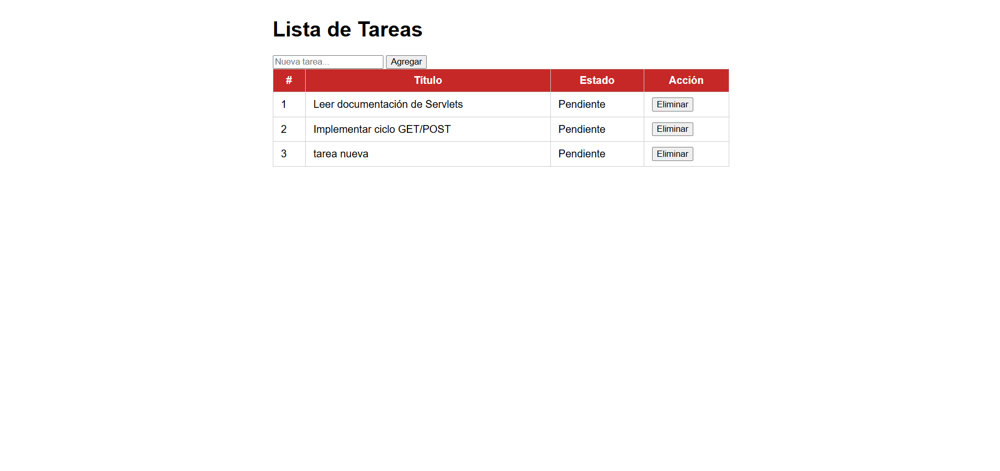
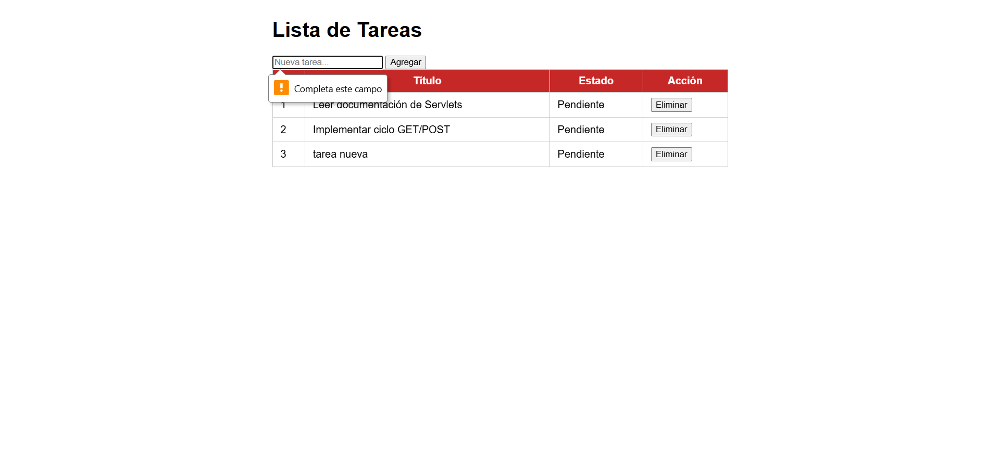
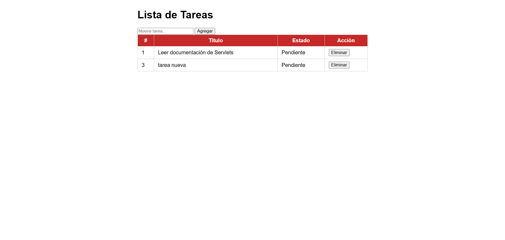

# Gestión de Tareas con Servlet

Laboratorio Unidad 5 - Programación Web  
Universidad Francisco de Paula Santander - 2026

## Descripción

Aplicación web Java que gestiona una lista de tareas en memoria usando Servlets y JSP. Implementa el patrón Post/Redirect/Get (PRG).

## Tecnologías

- Java 23
- Jakarta Servlet API 6.0
- JSTL 3.0
- Apache Tomcat 10.1.55
- Maven 3.8+

## Funcionalidades

- Listar tareas existentes (GET)
- Agregar nueva tarea con validación (POST)
- Eliminar tarea por ID (POST)
- Redirección automática tras POST (patrón PRG)

## Capturas de pantalla

### Lista de tareas

### Agregar tarea

### Validación de error

### Eliminar tarea
